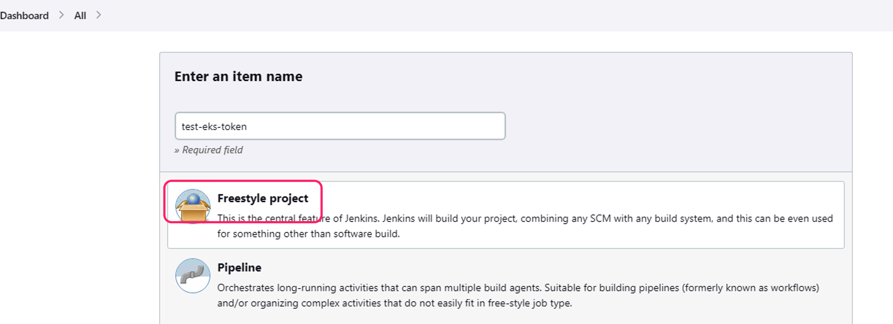
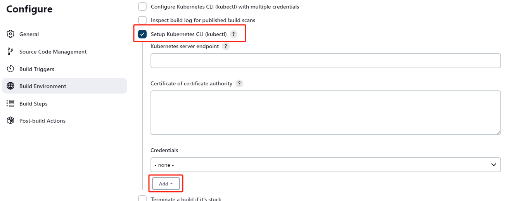
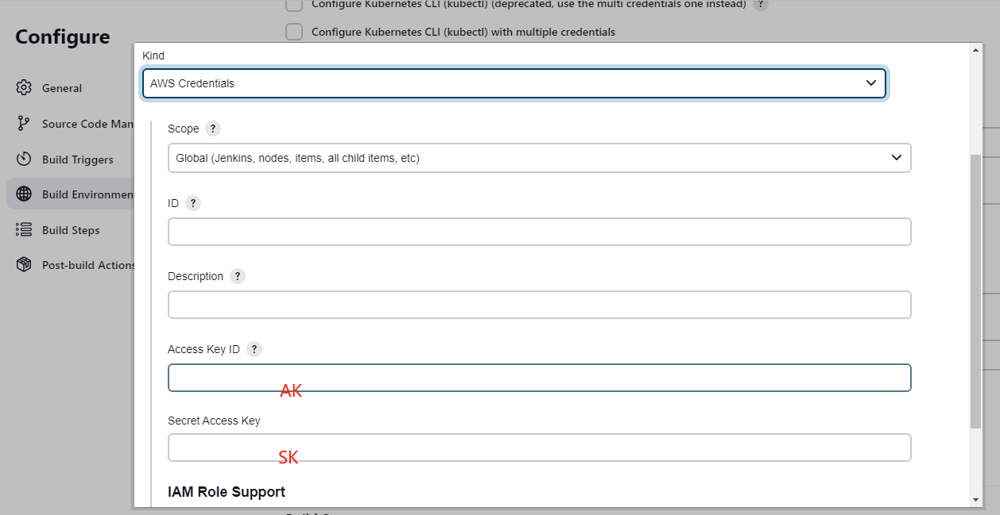
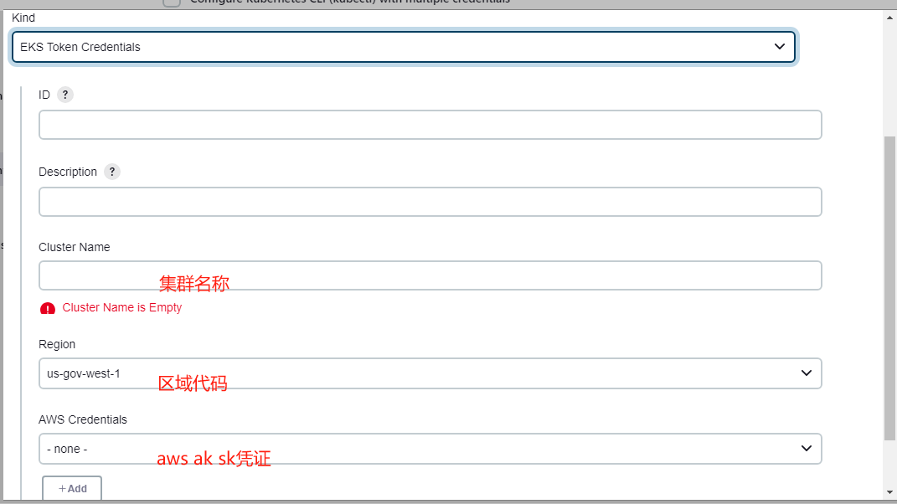
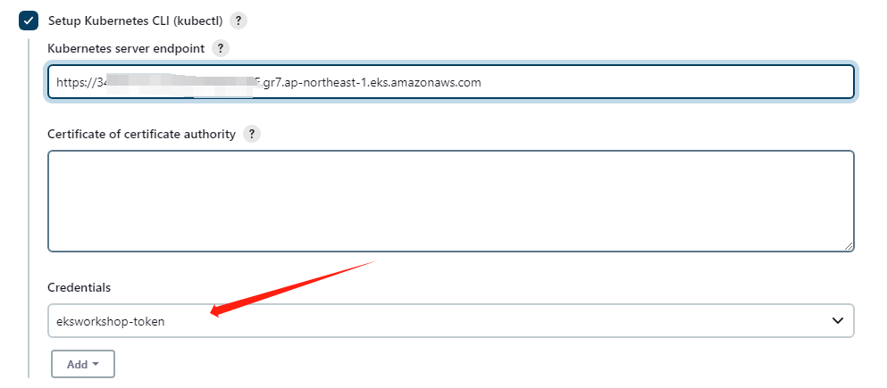
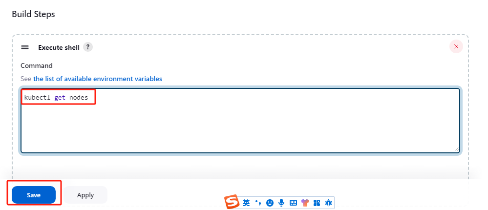
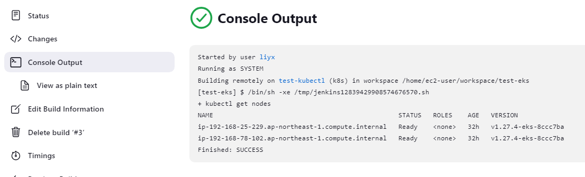

## Client API integration


1. Jenkins 插件准备
```
Kubernetes Plugin
EKS Token Plugin
```

2. Agent 准备、注册

```
Agent 安装 kubectl 并注册到 Jenkins
```

3. Job 配置
















## Kubernetes as Cloud ingegration

TBA