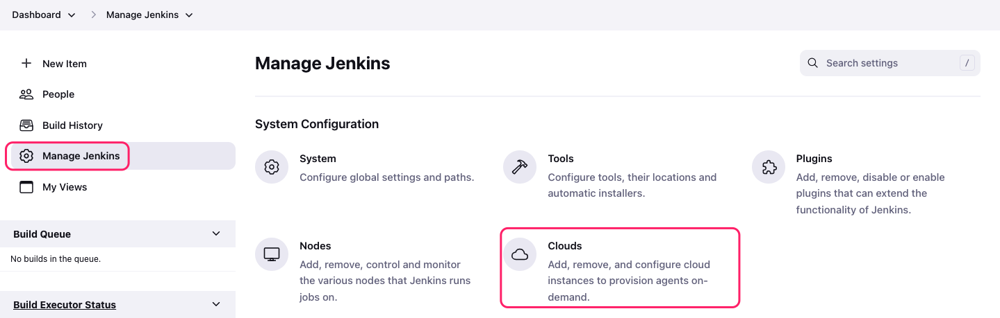
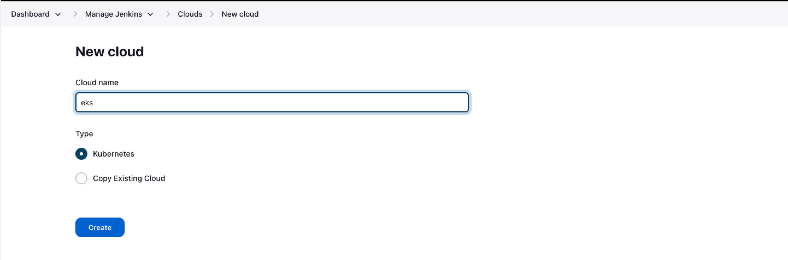
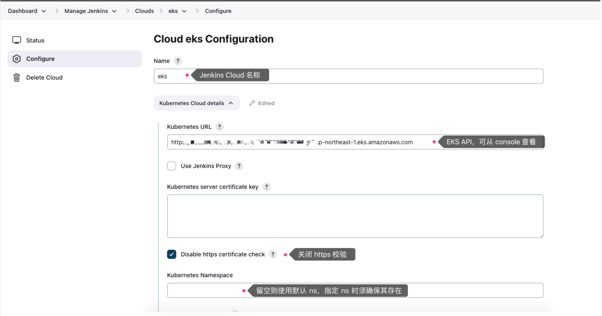
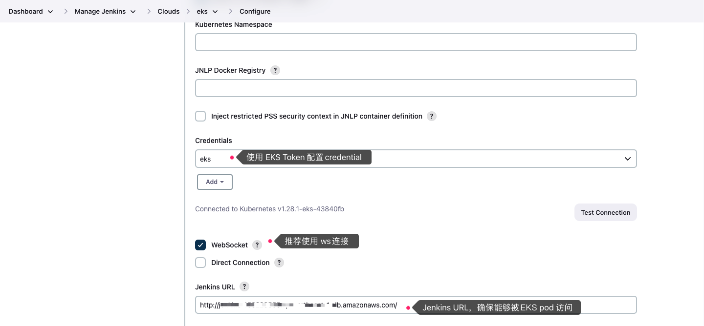
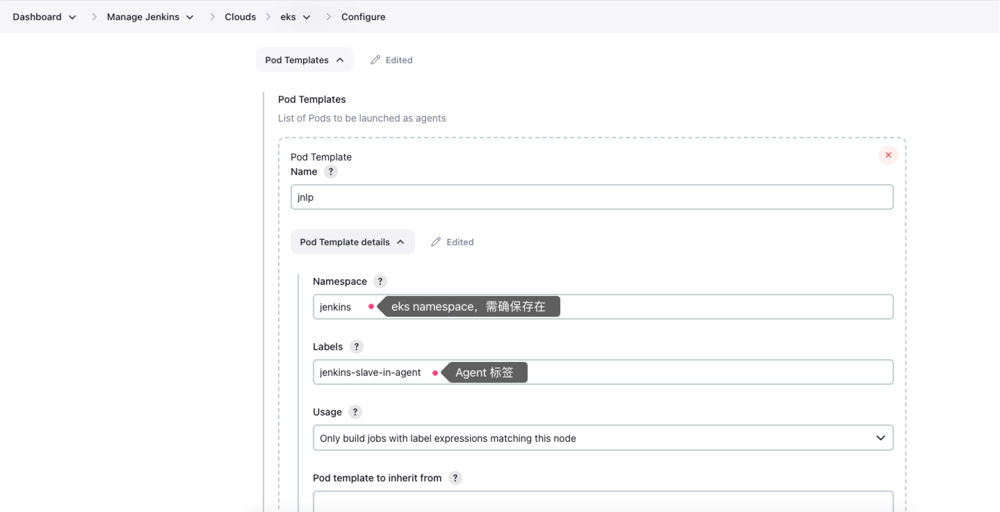
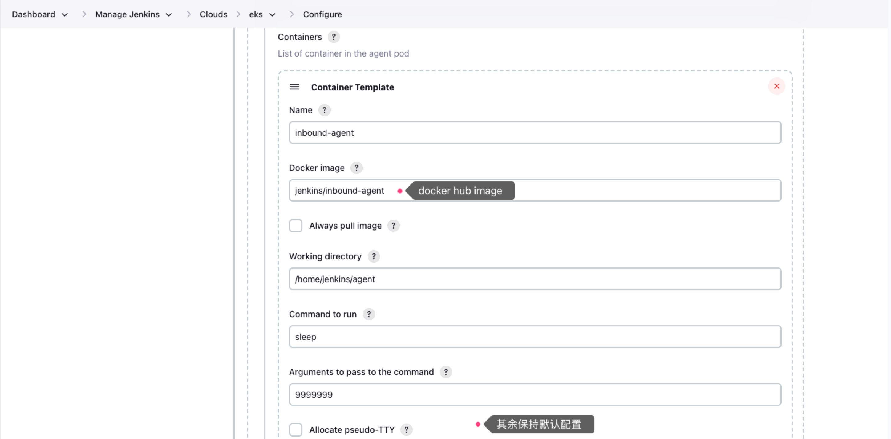
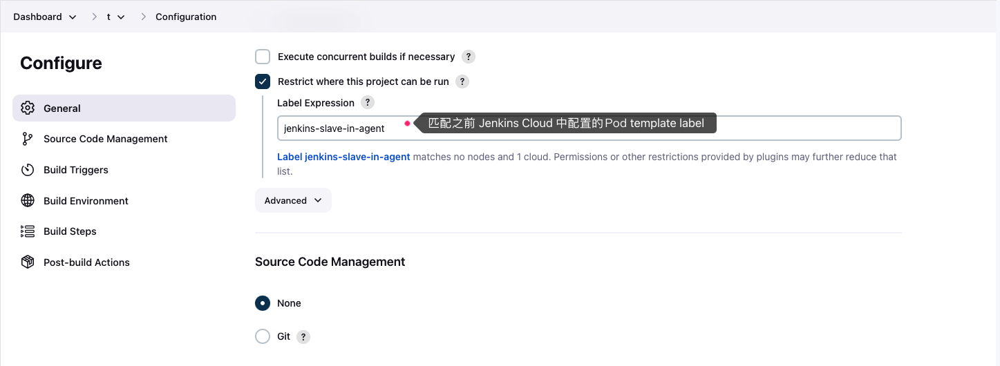
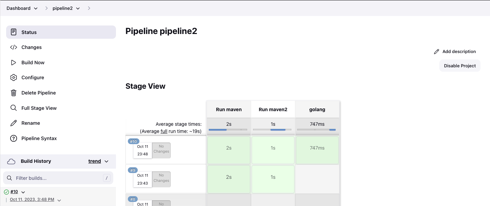

## K8S Client API integration

目标：在 Agent 中运行 kubectl 命令与 K8S 集群交互，配置方式如下。

1. Jenkins 插件准备，安装插件后重启 Jenkins 环境确保生效
```
Kubernetes Plugin
EKS Token Plugin
```

2. Agent 准备、注册

```
Agent 安装 kubectl 并注册到 Jenkins
```

3. Job 配置


## Kubernetes as Cloud ingegration

目标：将 EKS 作为 K8S Cloud 集成到 Jenkins。

1. Jenkins 插件准备，安装插件后重启 Jenkins 环境确保生效

```
Kubernetes Plugin
EKS Token Plugin
```

2. Jenkins Cloud 配置













3. Freestyle Job 配置



构建时会自动在 EKS 拉起 Pod 作为 Agent，结束后销毁
```
Started by user liyx
Running as SYSTEM
Agent jnlp-zx9jr is provisioned from template jnlp
---
apiVersion: "v1"
kind: "Pod"
metadata:
  labels:
    jenkins: "slave"
    jenkins/label-digest: "851e9adf5e194eb55d242a969dbbdfa5db1e89cd"
    jenkins/label: "jenkins-slave-in-agent"
  name: "jnlp-zx9jr"
  namespace: "jenkins"
spec:
  containers:
  - args:
    - "9999999"
    command:
    - "sleep"
    image: "jenkins/inbound-agent"
    imagePullPolicy: "IfNotPresent"
    name: "inbound-agent"
    resources: {}
    tty: false
    volumeMounts:
    - mountPath: "/home/jenkins/agent"
      name: "workspace-volume"
      readOnly: false
    workingDir: "/home/jenkins/agent"
  - env:
    - name: "JENKINS_SECRET"
      value: "********"
    - name: "JENKINS_AGENT_NAME"
      value: "jnlp-zx9jr"
    - name: "JENKINS_WEB_SOCKET"
      value: "true"
    - name: "JENKINS_NAME"
      value: "jnlp-zx9jr"
    - name: "JENKINS_AGENT_WORKDIR"
      value: "/home/jenkins/agent"
    - name: "JENKINS_URL"
      value: "http://jenkins-158228555.ap-northeast-1.elb.amazonaws.com/"
    image: "jenkins/inbound-agent:3148.v532a_7e715ee3-1"
    name: "jnlp"
    resources:
      requests:
        memory: "256Mi"
        cpu: "100m"
    volumeMounts:
    - mountPath: "/home/jenkins/agent"
      name: "workspace-volume"
      readOnly: false
  hostNetwork: false
  nodeSelector:
    kubernetes.io/os: "linux"
  restartPolicy: "Never"
  volumes:
  - emptyDir:
      medium: ""
    name: "workspace-volume"

Building remotely on jnlp-zx9jr (jenkins-slave-in-agent) in workspace /home/jenkins/agent/workspace/t
[t] $ /bin/sh -xe /tmp/jenkins12146970252599399295.sh
+ ls -l
total 0
+ echo /opt/java/openjdk/bin:/usr/local/sbin:/usr/local/bin:/usr/sbin:/usr/bin:/sbin:/bin
/opt/java/openjdk/bin:/usr/local/sbin:/usr/local/bin:/usr/sbin:/usr/bin:/sbin:/bin
+ sleep 39
Finished: SUCCESS
```

4. Jenkins Pipeline 配置

Jenkinsfile
```
pipeline {
  agent {
    kubernetes {
      yaml '''
        apiVersion: v1
        kind: Pod
        metadata:
          labels:
            some-label: some-label-value
        spec:
          containers:
          - name: maven
            image: maven:alpine
            command:
            - cat
            tty: true
          - name: busybox
            image: busybox
            command:
            - cat
            tty: true
          - name: golang
            image: golang:1.16.5
            command:
            - sleep
            args:
            - 99d
        '''
      retries 2
    }
  }
  stages {
    stage('Run maven') {
      steps {
        container('maven') {
          sh 'mvn -version'
        }
        container('busybox') {
          sh '/bin/busybox'
        }
      }
    }
    
    stage('Run maven2') {
      steps {
        container('maven') {
          sh 'mvn -version'
        }
        container('busybox') {
          sh '/bin/busybox'
        }
      }
    }
    
    stage('golang') {
      steps {
        container('golang') {
          sh 'go version'
        }
      }
    }
  }
}
```

执行效果

